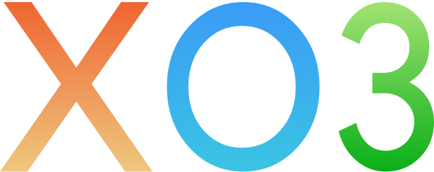

<p align="center">
  
</p>

<p align="center">
  <b>Tic Tac Toe with a twist.</b><br>
  Timed turns. Three-piece limit. No draws.
</p>

<p align="center">
  
  
  
</p>

---

## What makes it different

Classic Tic Tac Toe always ends in a draw if both players know what they're doing. XO3 fixes that:

- **3-piece limit** — each player can only have three pieces on the board. Place a fourth and your oldest one vanishes.
- **Timed turns** — a countdown timer (3–10 seconds) keeps the pressure on. Run out of time and you lose your turn.

The result is a game that's always moving, never stale.

## Game Modes

| Mode | Description |
|------|-------------|
| **Local** | Two players on the same device |
| **Online** | Real-time multiplayer via Game Center |
| **vs AI** | Easy, Medium, or Hard difficulty |

## Features

- Dark mode, light mode, or follow system
- Sound effects with toggle
- Adjustable timer duration
- Glass-effect UI with smooth animations
- iPhone and iPad support

## Architecture

```
Tim-Bak-Toe/
├── Core/
│   ├── AI/              # Easy, Medium, Hard AI strategies
│   ├── GameEngine/      # Game logic and win detection
│   ├── Models/          # Player, Board, GameState, GameMode
│   ├── Multiplayer/     # Game Center manager and adapter
│   └── Timer/           # Turn timer
├── Features/
│   ├── Game/            # Game view, board, pieces, overlays
│   ├── Home/            # Home screen and mode picker
│   ├── Onboarding/      # First-launch onboarding
│   └── Settings/        # Settings screen and view model
├── DesignSystem/        # Theme, components, shapes, layout
└── Utilities/           # Sound, animations, extensions
```

## Building

Requires **Xcode 26** and **iOS 26 SDK**.

```bash
git clone https://github.com/v-i-s-h-a-l/Tim-Bak-Toe.git
open Tim-Bak-Toe.xcodeproj
```

No external dependencies. Build and run.

## Credits

- **Code** — [Vishal](https://twitter.com/v_s_h_a_l)
- **Art** — [Alistair](http://akbmedia.co.uk)

## Links

- [Website](https://v-i-s-h-a-l.github.io/Tim-Bak-Toe/)
- [Support](https://v-i-s-h-a-l.github.io/Tim-Bak-Toe/support.html)
- [Privacy Policy](https://v-i-s-h-a-l.github.io/xo3-privacy-policy/)

## License

All rights reserved.
